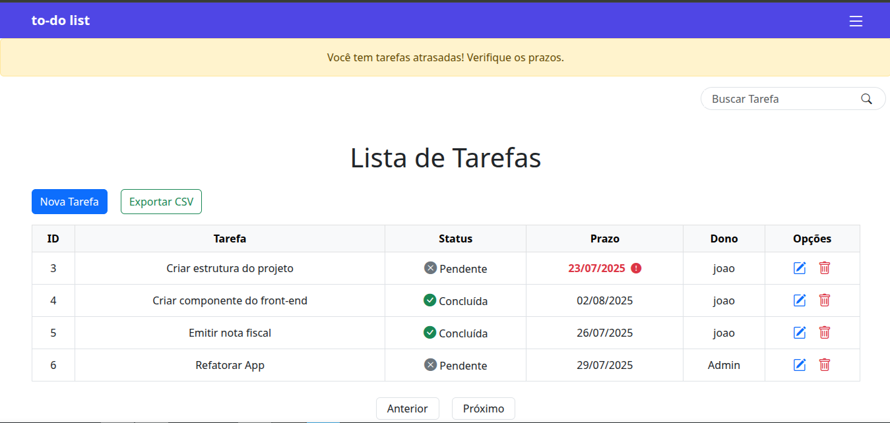
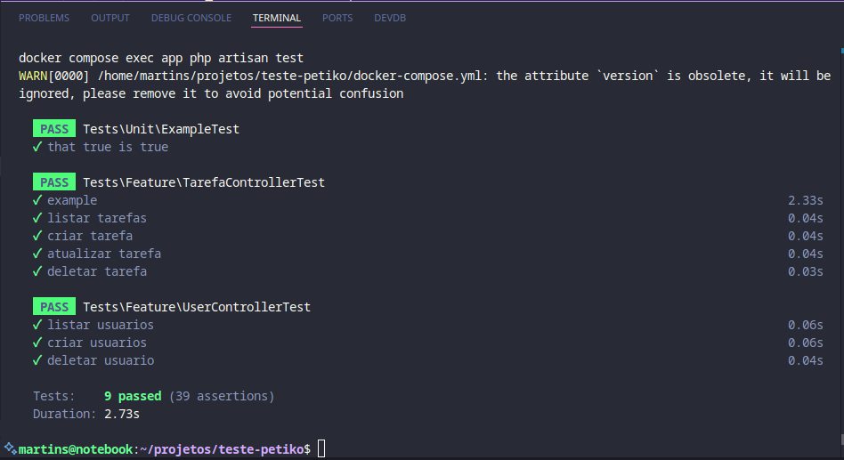

# 📝 To-do List Laravet + Vue.js

Este projeto é uma aplicação de gerenciamento de tarefas desenvolvida com Laravel (backend) e Vue.js (frontend via Inertia.js), com ambiente configurado via Docker.

---
## Funcionalidades
- CRUD de Usuario
- CRUD de Tarefa
#### Funcionalidades bônus
- Download de lista de tarefas em CSV
- Barra de pesquisa, para localizar tarefas/usuarios
- Notificação quando há tarefas atrasadas
- Nivel de permissão
    - Apenas usuarios administradores conseguem cadastrar usuarios e tarefas 
    - Modificar nivel do usuario
- Command para verificar tarefas vencidas 
#### Uso do Framework 
- Validetions [FormRequest]
- Migrations 
- Seeders
- Relationships  
- Commands
- Tests

## 🚀 Como rodar o projeto localmente

### 1. Clone o repositório

```bash
git clone https://github.com/martinss08/teste-petiko.git
cd teste-petiko
```

### 2. Instale as dependências do Laravel

```bash
make build 
```
## 3. Acesse o projeto

Para acessar o projeto, acesse [http://localhost:8000](http://localhost:8000)

## 👤 Usuário padrão (seeded)

Após rodar `make build`, você poderá acessar com:

- **Email:** `admin@admin.com`  
- **Senha:** `123456`

---

## 🐞 Comandos úteis

| Ação                          | Comando                                                  |
|-------------------------------|----------------------------------------------------------|
| Subir containers              | `make up`                                                |
| Parar containers              | `make down`                                              |
| Rodar os testes               | `make test`                                              | 

---

## Implementado Testes Automatizados


## 💡 Estrutura

- `app/` – Lógica de negócio (Laravel)
- `resources/js/` – Componentes Vue + Bootstrap
- `routes/` – Arquivos de rotas (web.php, console.php, etc.)
- `docker/` – Arquivos de configuração dos containers (caso existam)

---

## 📦 Tecnologias

- Laravel 10+
- Vue 3 (Inertia.js)
- Bootstrap 5
- Docker / Docker Compose
- MySQL / phpMyAdmin

---